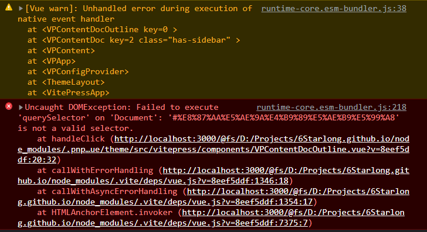

# 使用 Vue 3 文档主题 {#use-vue3-theme}

> 本站主题 Fork 自 [docs-zh-cn](https://github.com/vuejs-translations/docs-zh-cn)，基于 [@vue/theme](https://github.com/vuejs/theme) 建立。该主题仅适用与 [Vue 官方文档](https://staging-cn.vuejs.org)，它不遵循 semver，并且可能包含特定于 Vue 文档的硬编码逻辑。<br/>

该主题不推荐直接使用，这里对该主题进行了部分修改以满足自定义需求。

## 快速开始 {#quick-start}

```sh
pnpm add @vue/theme
```

```js{6}
// .vitepress/config.js
import { defineConfig } from 'vitepress'
import baseConfig from '@vue/theme/config'

export default defineConfig({
  extends: baseConfig
  // ...
})
```

```js
// .vitepress/theme/index.js
import { VPTheme } from '@vue/theme'
import ThemeLayout from './components/ThemeLayout.vue'

export default {
  ...VPTheme,
  Layout: ThemeLayout
}
```

## 自定义主题 {#custom-theme}

通过查看源码可知，主题的 logo 和 title 是写死且无法配置的。既然如此，我们在 ThemeLayout 组件中通过修改 `NavBarTitle` 节点元素的内容，并使用配置文件中的参数进行替换。

1. 操作 dom

```vue{7,13-15,18,19}
<script setup>
import { onMounted } from 'vue'
import { useData } from 'vitepress'
import { VPTheme } from '@vue/theme'

// 引入自定义  NavBarTitle 组件
import NavBarTitle from './NavBarTitle.vue'

const { Layout } = VPTheme
const { site, theme } = useData()

onMounted(() => {
  // document.querySelector('.VPNavBarTitle').innerHTML = `
  // 
  // <span class="text">${site.value.title}</span>`

  // 创建虚拟 dom 并挂载到 VPNavBarTitle 元素节点上
  const app = createApp(NavBarTitle, { logo: theme.value.logo, title: site.value.title })
  app.mount(document.querySelector('.VPNavBarTitle'))
})
</script>

<template>
  <Layout> </Layout>
</template>
```

2. 通过 style (不推荐)

```vue{12,13,17,18,28,43,48,49}
<script setup>
import { onMounted } from 'vue'
import { useData } from 'vitepress'
import { VPTheme } from '@vue/theme'

const { Layout } = VPTheme
const { site, theme } = useData()

// 1.通过设置 attribute，并在 style 中使用 attr 引入
onMounted(() => {
  const VPNavBarTitle = document.querySelector('.VPNavBarTitle')
  // VPNavBarTitle.setAttribute('style', `background-image: url("${theme.value.logo}")`)
  // VPNavBarTitle.setAttribute('data-after', site.value.title)
})

// 2.通过 v-bind in css
const logo = theme.value.logo
const title = site.value.title
</script>

<template>
  <Layout> </Layout>
</template>

<style>
.VPNavBarTitle .logo,
.VPNavBarTitle .text {
  display: none;
}

.VPNavBarTitle {
  width: 150px;
  /* background-size: 2rem;
  background-repeat: no-repeat;
  background-position: left; */
}

.VPNavBarTitle::before {
  content: '';
  position: absolute;
  width: 2rem;
  height: 2rem;
  background-image: v-bind(`url('${logo}') `);
  background-size: cover;
}

.VPNavBarTitle::after {
  /* content: attr(data-after); */
  content: v-bind(` '${title}' `);
  position: absolute;
  margin-left: 40px;
  font-size: 16px;
  font-weight: 500;
}
</style>
```

## 指北 {#theme-guide}

### 当前主题 Frontmatter 预定义变量 {#theme-frontmatter-variables}

- `title: String | undefined`

  定义当前页面的 title，默认显示大标题。

- `page: Boolean | undefined`

  定义作为页面展示，禁用 markdown 语法支持，显示 footer 和禁用 aside。

- `sidebar: Boolean | undefined`

  定义显示或禁用 sidebar。

- `aside: Boolean | undefined`

  定义显示或禁用 aside。

- `outline: Boolean | deep | undefined`

  定义显示或禁用 outline，或者设置 `deep` 呈现深层目录结构。

- `footer: Boolean | undefined`

  定义显示或禁用 footer。

### 目录 {#toc}

目录结构会在主题右侧 `ON THIS PAGE` 下显示。切换目录时发现如下报错：



这是因为目录中的中文字符会被作为描点应用到 `URL` 中，主题无法识别导致报错。<br/>
使用如下写法把中文字符转换为英文描点：

```md
### 目录 {#toc}
```
